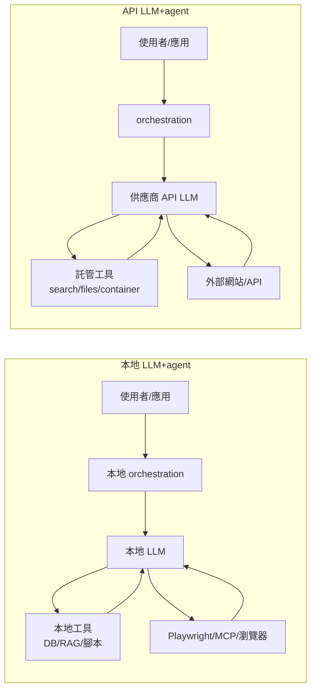
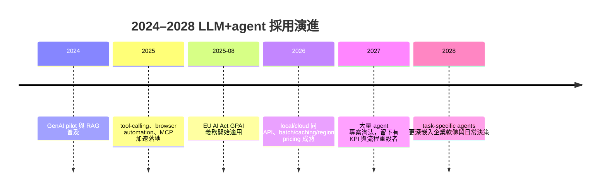

# 本地 LLM+agent 與 API LLM+agent 的未來發展、應用場景與工作效率影響

## Executive Summary

未來主流不會是「本地」與「API」的二選一，而是混合式路由：把資料敏感、穩態高頻、可預測工作量的步驟留在本地；把長程推理、多模態、突發高併發與雲端工具整合交給 API 模型。這個判斷的技術基礎在於：entity["company","Ollama","local llm platform"] 已將本地與 cloud 放在同一 API 與工具鏈之下，而 entity["company","Moonshot AI","kimi ai company"] 的 Kimi K2.6 等前沿模型則把長上下文、tool use、web search、batch 與多模態做成平台能力；API 供應商同時提供快取、批次與區域化處理等成本/合規選項[1][2][14][15]。 citeturn28view0turn28view1turn24view0turn22view5turn35view0turn33view0turn34view0turn9view1turn9view0

但 LLM+agent 對效率的影響高度異質，不能用單一「加速或取代」敘事概括。客服場景的田野研究顯示，生成式 AI 可讓平均生產力提升約 14–15%，且對新手與低技能工作者效果更大；相反地，針對資深開源開發者的隨機對照研究發現，早期 2025 年的 AI 工具使任務完成時間反而增加 19%[11][12]。因此，agent 的價值取決於任務可分解性、可驗證性、既有上下文複雜度，以及 human-in-the-loop 的審查成本。 citeturn32view0turn19search10turn14view0

組織採用正在快速上升，但大多仍停留在試點與局部擴散。entity["company","Microsoft","software company"] 2025 Work Trend 指出，81% 的領導者預期未來 12–18 個月內 agents 會中度或大幅納入公司 AI 策略；entity["company","McKinsey & Company","consulting firm"] 2025 全球調查顯示，62% 的組織至少已開始實驗 AI agents，但多數尚未擴展到企業級價值；entity["company","Gartner","research firm"] 則警告超過 40% 的 agentic AI 專案可能在 2027 年前被取消[7][8][10]。這表示下一階段的關鍵不是「能不能做 agent」，而是「哪些流程值得 agent 化、如何量測 ROI、如何控制風險」。 citeturn12view2turn11view1turn11view3

## 背景與定義

| 術語 | 本文定義 |
|---|---|
| 本地 LLM | 模型權重與推論在自有裝置、私有伺服器或內網節點上執行；典型介面是本地 HTTP API，例如 `localhost` 服務[1][18]。 |
| API LLM | 透過模型供應商的雲端端點呼叫推論；通常伴隨長上下文、多模態、快取、batch、search 或容器工具[2][14][15]。 |
| agent | 由 LLM 與工具形成的迭代 loop：模型決策、呼叫工具、讀回結果、再決策，直到達成終止條件[3]。 |
| tool-calling | 模型輸出結構化工具請求，由程式或平台執行外部函式，再把結果餵回模型[1][2][3]。 |
| browser automation | 讓 agent 以程式方式操作瀏覽器、點擊元素、抓取頁面與表單；在現代實作中常透過 Playwright 與 MCP 完成[4]。 |
| 文獻 agent | 本文術語：將 LLM 連接 PubMed/PMC/Europe PMC 等 API，完成檢索、抓取、去重、解析與摘要的代理流程[5][6]。 |

上表中的 agent 與 tool-calling 定義主要依據 entity["company","LangChain","agent framework"] 的 agents 文件、Ollama 與 Kimi 的工具呼叫文件；而「文獻 agent」不是單一產品名稱，而是基於 entity["organization","NCBI","nih center"] Entrez E-utilities 與 Europe PMC REST API 的工程模式[1][2][3][5][6]。 citeturn22view2turn0search8turn22view5turn22view3turn6search0turn6search1

## 架構與成本比較

此圖反映的核心差異在於資料路徑與控制邊界：本地路線的模型推論與大多數中介狀態可留在自有環境；API 路線則把 prompt、response 與部分工具調用交由供應商基礎設施處理，但換得更大的模型、較低的初始部署門檻與更高的彈性[1][2][4][14][15]。 citeturn28view0turn28view1turn25view0turn22view5turn22view1turn9view1turn9view0

| 面向 | 本地 LLM+agent | API LLM+agent |
|---|---|---|
| 部署架構 | App → 本地 orchestrator → 本地模型/API → 本地工具/瀏覽器 | App → orchestrator → 供應商 API → 託管模型/工具 |
| 資源需求 | 需自備 CPU/GPU/記憶體；效能受模型大小、量化與上下文長度影響 | 本地僅需輕量用戶端與網路；重計算由供應商承擔 |
| 延遲 | 無網路往返，但有冷啟動/載入模型成本 | 有網路與佇列成本，但通常有更高級硬體與快取 |
| 可用性 | 無預設 SLA，需自行監控與備援 | 供應商託管，通常較容易擴容與平行化 |
| 可擴展性 | 受 VRAM/RAM、節點數與佈署能力限制 | 配額、batch、並行與區域端點較成熟 |
| 維運複雜度 | 驅動、量化、映像檔、觀測、補丁都需自理 | 供應商吸收大部分 infra 維運，但有供應商綁定 |
| 資料流向 | 若不出網，資料可留在內網；但 browser/search 工具仍可能外送 | prompt/response 與部分工具調用進入供應商環境 |
| 隱私/合規風險 | 低到中；若內網隔離可最低，但暴露 API/代理/瀏覽器權限仍有風險 | 中到高；涉及跨境、供應商審查與資料分類，部分供應商提供區域處理但可能加價 |
| 成本模型 | CAPEX + 電力 + 維運工時；邊際 token 成本接近零 | token、tool call、container、search、區域化與 batch 等多元計價 |

表一整合了 Ollama 的本地/雲端 API、Kimi 的 OpenAI 相容 API 與 built-in web search、以及 Playwright MCP 的瀏覽器能力；其中「維運複雜度」與「風險等級」為基於官方文件的工程判斷[1][2][4][14][15]。 citeturn28view0turn28view1turn25view0turn22view5turn33view0turn34view0turn9view1turn9view0

模型大小、硬體規格與 token 價格均未指定，因此下表提供低/中/高情境估算，供文章與專案規劃直接引用。

| 指標 | 本地低 | 本地中 | 本地高 | API 低 | API 中 | API 高 |
|---|---:|---:|---:|---:|---:|---:|
| 代表情境 | 7–8B、單機/筆電 | 14–32B、單 GPU | 70B+、多 GPU | mini/fast | 主力 reasoning | premium frontier |
| 初始成本 | US$0–500 | US$1k–3k | US$8k–30k+ | US$0 | US$0 | US$0 |
| 暖啟動 TTFT | 0.2–1.0s | 0.5–2.0s | 1–5s | 0.4–1.5s | 0.6–2.5s | 1–5s |
| 穩態輸出 | 20–120 tok/s | 10–60 tok/s | 5–30 tok/s | 50–250 tok/s | 30–150 tok/s | 10–80 tok/s |
| 邊際執行成本 | 電力約 US$0.01–0.05/小時 | US$0.03–0.15/小時 | US$0.10–0.60/小時 | 輸入 US$0.10–0.75/M；輸出 US$0.625–4.5/M | 輸入 US$1–5/M；輸出 US$5–25/M | 輸入 US$15–30/M；輸出 US$90–180/M |
| 併發能力 | 1–4 | 1–8 | 4–32 | 依配額 | 依配額 | 依配額 |

表二中的 API 單價錨定於 entity["company","OpenAI","ai company"] 與 entity["company","Anthropic","ai company"] 的公開價格頁；Kimi 另有 `$web_search` 每次 US$0.005 與 batch 價格為標準價 60% 的規則。Ollama cloud 則不是 token 計費，而是按實際 GPU 使用量。電力成本為本文假設 100–700W、電價 US$0.1–0.3/kWh 之估算[1][2][14][15]。 citeturn24view0turn33view0turn34view0turn9view1turn9view0

## 應用場景與案例

| 場景 | 較優方案 | 原因 | 實務建議 |
|---|---|---|---|
| 內部知識庫、法遵、機密文件問答 | 本地或混合 | 最重視資料留邊界與審計可控性 | 檢索與摘要先本地化；僅把去識別、低敏感內容升級到 API |
| 文獻搜尋與研究助理 | 混合 | API 善於長上下文整合；本地適合保存私人筆記與中間資料 | 先走 PubMed/PMC/Europe PMC API，再做摘要；避免直接亂爬一般網頁 |
| 私有程式庫 coding agent | 混合偏本地 | 原始碼與 issue 討論多半敏感；但複雜重構與多檔規劃常需更強模型 | 日常補全、測試、重構說明留本地；複雜 bug-hunt 或多 repo 規劃才升級到 API |
| 瀏覽器自動化、SaaS 後台操作 | API 或混合 | 長程規劃、表單錯誤修復、突發伸縮較吃模型能力 | 用 Playwright MCP，但必須白名單網域、最小權限與完整 action log |
| 客服、行銷、批量內容營運 | API | 初期導入快、batch/caching 成本結構清楚、容易平行擴張 | 以批次、快取、模板化提示與 QA 流水線控成本 |
| 邊緣裝置、離線場域、空隔網路 | 本地 | 無網可用、法規與資安優勢最大 | 選小模型 + 任務專用工具，不追求單一萬能 agent |
| 大量後台批次處理 | 視負載而定 | 穩定長期負載常使本地攤提更划算；短期爆量則 API batch 佔優 | 比較 30–90 天總持有成本，而非只看每百萬 token 價格 |

這些場景的勝負手，不在「模型誰更聰明」，而在資料敏感度、是否需要即時擴容、是否依賴 browser/search 工具，以及任務是否可被精確驗證。Kimi K2.6 等 API 模型已把 256K、多步工具調用與搜尋做成標配；本地端則可藉由 Ollama、OpenAI-compatible 端點與 Playwright/MCP 建出可控的 agent 工作流[1][2][4][18]。 citeturn22view5turn26view3turn28view2turn22view1turn27view1

## 效率量化、風險與限制

| 指標 | 建議定義 |
|---|---|
| Throughput | 完成任務數/小時，或成功工具回合數/小時 |
| Latency | TTFT + time-to-final + 工具執行時間 |
| Token/tool cost | input × 單價 + output × 單價 + search/file/container 費 |
| Human-in-the-loop 節省 | （人工分鐘 − agent 輔助分鐘）/ 人工分鐘 |
| 錯誤率 | 事實錯誤、工具失敗、操作失敗 / 100 次執行 |
| 可靠性 | pass@1、rerun success、fallback rate、人工接管率 |

最重要的不是單次 demo 成功，而是建立「任務級」與「流程級」雙層指標。建議至少記錄：模型版本、prompt hash、工具序列、token 與工具費、總耗時、人工修正分鐘、重跑次數與最終是否被採納。對 agent 而言，總成本往往不是 token 本身，而是重試、搜索、容器、與人工覆核時間的總和[2][3][14][15]。 citeturn22view2turn35view0turn9view1turn9view0

效率影響必須依任務類型拆開看。Brynjolfsson 等人的工作場域研究顯示，客服 agent 的平均生產力提升約 14–15%，對新手與低技能工作者更高；但 METR 對熟悉自身 codebase 的資深開源開發者發現，AI 工具使完成時間增加 19%。這說明 agent 更像「能力放大器」，而不是對所有任務等比例加速器：越標準化、越可驗證、越少既有隱性上下文的工作，越容易變快；反之，熟悉代碼庫上的高品質變更、隱性架構知識與高審查成本任務，反而可能變慢[11][12]。 citeturn32view0turn19search10turn14view0

風險主要有四類。其一是安全與資料外洩：Ollama 明確區分本地與 cloud，前者預設不把 prompt 傳回服務端，後者則必須在雲端處理 prompts/responses；一旦你再接上 browser/search/tool，資料邊界就不再只由模型位置決定[1]。其二是 hallucination 與不準確：McKinsey 2025 調查顯示，51% 的組織已遭遇至少一次 AI 負面後果，將近三分之一與不準確有關[8]。其三是可解釋性與法遵：entity["organization","European Commission","eu executive body"] 公布的 EU AI Act 時程顯示，GPAI obligations 已自 2025-08-02 起適用，多數規則於 2026-08-02 起全面適用；這對 API 路線特別重要，因為資料跨境、供應商文件、版權政策與事故通報都可能進入合規範圍[16]。其四是治理：entity["organization","NIST","us standards institute"] 的 GenAI Profile 強調要把生成式 AI 的特有風險納入正式風險管理流程，而不是只靠模型輸出後驗修補[17]。 citeturn25view0turn11view1turn31search0turn31search2turn31search1turn31search4

## 未來趨勢與建議

未來三年最可能的走向是「本地做資料面，API 做能力面，agent 做流程面」。資料面包括私有文件、向量檢索、日常 coding 補全與內網腳本；能力面包括前沿推理、多模態、長文整合、突發大流量與託管工具；流程面則由 agent/orchestrator 負責權限、記憶、重試與 human approval。這個方向與 Ollama 的 local/cloud 同 API、Kimi/OpenAI/Anthropic 的 batch/快取/區域處理、以及 Playwright MCP 與 agent server 生態的成熟一致；而企業端真正能變現的關鍵，仍是 workflow redesign，而非單純塞入聊天模型[1][2][4][8][14][15]。 citeturn28view0turn28view1turn22view5turn34view0turn22view1turn11view1turn9view1turn9view0

此外，agent 能處理的「時間跨度」正成為比單純 benchmark 更有商業意義的指標。METR 2025 提出的 time horizon 指出，前沿模型在其任務集上達到 50% 成功率的任務長度約為 50 分鐘，且自 2019 到 2025 呈現約每 7 個月翻倍的趨勢；Anthropic 2026 的 Economic Index 則顯示，在真實 API 使用情境中，工具與任務分解可以延長有效任務跨度。這意味著 API 路線在長鏈、多工具場景的優勢，短期內仍明顯；本地路線則會因小模型、多模態與推論引擎持續改進而吃下更多「足夠好」的高頻任務[9][13][18]。 citeturn29search0turn29search2turn13view2turn27view1

這條時間線綜合了 Microsoft、McKinsey、Gartner、EU AI Act 與 METR 的訊號：採用會持續擴大，但專案淘汰率也會很高；真正留下的，不是最會 demo 的 agent，而是最能被治理、量測與整合到流程的 agent[7][8][10][13][16]。 citeturn12view2turn11view1turn11view3turn31search0turn29search0

## 結論與行動建議

對研究者而言，最值得採用的是「本地語料與筆記管理 + API 級第二輪綜合推理 + 文獻 API 優先」；這可同時兼顧可重現性、隱私與深度整理。對開發者而言，最務實的順序是先用 API 快速驗證 agent 工作流，再把敏感與高頻步驟本地化；不要用 benchmark 取代對真實 repo、真實工具鏈與真實 review 成本的測試。對企業而言，建議一開始就做三件事：資料分級、權限邊界、KPI 儀表板；然後只在「可驗證、可回退、可審計」的流程上擴大 agent。最重要的判準不是「要不要 all-in local」或「要不要 all-in API」，而是：**哪一個步驟必須留在邊界內，哪一個步驟值得外包給更強的模型與工具**[1][2][8][10][16][17]。 citeturn25view0turn22view5turn11view1turn11view3turn31search0turn31search1

## 參考文獻與來源

[1] Ollama 官方文件：API Introduction、Cloud、FAQ、Pricing、OpenAI compatibility、OpenClaw integration，2026。 citeturn28view0turn28view1turn25view0turn24view0turn28view2turn28view3  
[2] Moonshot/Kimi 官方文件與 model card：Kimi K2.6 Quickstart、Pricing、WebSearch、Batch、Kimi-K2.6 model card，2026。 citeturn22view5turn35view0turn33view0turn34view0turn26view3  
[3] LangChain Docs, “Agents,” 2026。 citeturn22view2  
[4] Playwright 官方文件：首頁與 Playwright MCP，2025–2026。 citeturn22view0turn22view1  
[5] NCBI 官方 API 文件：Entrez Programming Utilities (E-utilities)，2026。 citeturn22view3  
[6] Europe PMC 開發者文件：Articles RESTful API、Developer resources，2026。 citeturn6search0turn6search1  
[7] Microsoft Work Trend Index 2025: *The year the Frontier Firm is born*，2025。 citeturn11view0turn12view2turn12view3  
[8] McKinsey Global Survey 2025: *The state of AI in 2025: Agents, innovation, and transformation*，2025。 citeturn11view1  
[9] Anthropic Economic Index: *New building blocks for understanding AI use*，2026。 citeturn11view2turn13view0turn13view2turn13view3  
[10] Gartner Press Release: *Over 40% of Agentic AI Projects Will Be Canceled by End of 2027*，2025。 citeturn11view3  
[11] Brynjolfsson, Li, Raymond, *Generative AI at Work*, NBER Working Paper 31161 / QJE version, 2023–2025。 citeturn32view0turn19search10turn21view0  
[12] Becker et al., *Measuring the Impact of Early-2025 AI on Experienced Open-Source Developer Productivity*, arXiv:2507.09089，2025。 citeturn14view0turn17search0turn18view1  
[13] Kwa et al., *Measuring AI Ability to Complete Long Tasks*, arXiv:2503.14499，2025。 citeturn29search0turn29search2  
[14] OpenAI API Pricing 文件，2026。 citeturn9view1  
[15] Anthropic Claude API Pricing 文件，2026。 citeturn9view0  
[16] European Commission：AI Act timeline、GPAI obligations/guidelines，2025–2026。 citeturn31search0turn31search2turn31search5  
[17] NIST：*Artificial Intelligence Risk Management Framework: Generative Artificial Intelligence Profile*，2024。 citeturn31search1turn31search4turn31search7  
[18] Qwen 官方 model card：Qwen3.5-0.8B，2026。 citeturn22view7turn27view0turn27view1